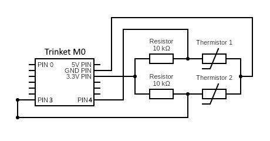

# Trinket-M0-dual-temperature-sensor
Simple project to allow monitoring of liquid temps in liquid cooling PCs with mainboards without temperature pins.

> [!WARNING]  
> Still waiting for the second sensor to arrive, code is not working with the second sensor right now.

## Usage
1. Make sure that your computer has two temp probes installed. For my project I used [Alphacool Thermosensor single 50cm | Part #10196](https://shop.alphacool.com/en/shop/controllers-and-sensors/temperature-sensor/sen-alphacool-thermosensor-single-50cm) and [Alphacool Eiszapfen temperature sensor | Part #17363](https://shop.alphacool.com/en/shop/controllers-and-sensors/temperature-sensor/sen-alphacool-eiszapfen-temperature-sensor-g1/4-ig/ig-with-ag-adapter-deep-black), but any will be fine ([sensor datasheet](https://download.alphacool.com/legacy/kOhm_Sensor_Table_Alphacool.pdf)).
2. Buy yourself a [Trinket M0](https://www.adafruit.com/product/3500). This is the board I used, but feel free to use a different one and change the code as needed. **Trinket M0** is very cool as it can natively output serial data via USB, and it can be seen in Windows as COM device. It also has RGB diode which is useful to have some indication of liquid temperature without need to access data in OS.
3. Solder some goldpins to your **Trinket M0** - pin **A3** and **A4** will be used as analog inputs.

> [!IMPORTANT]  
> Connect the sensor for ambient temperature to **A3** and liquid sensor to **A4**
4. Flash [trinket_m0_temp_sensor.ino](src/trinket_m0_temp_sensor/trinket_m0_temp_sensor.ino) into your board.
5. Connect temp probes into your board.
6. Power your **Trinket M0** with usb from your PC. It should immediately display colors that indicate temperature:

| Avg. Color | Temp delta   | Description  |
| ---------- | ------------ | ------------ |
| Blue       | < 4          | Ambient      |
| Green      | 5 - 12       | Idle         | 
| Yellow     | 13 - 20      | Light load   |
| Orange     | 21 - 33      | Regular load |
| Red        | 34 - 40      | Overheat     |
| Hot Pink   | > 40         | Danger!      |

Keep in mind that colors will tend to shift from blue -> green -> yellow -> orange -> red smoothly, so it's best to expect some color range as indication of actual temperature.

## Reading the output from the **Trinket M0**
You can use the tool [PuTTY](https://www.putty.org) to read the output. On PuTTY, switch the connection type to `Serial`, set the `Serial Line` to your COM port (COM6, for instance), and verify that the speed is `9600`.  
When you click open, it should be reading out values.

## Control PC fans using temp sensor - FanControl Plugin
1. I use tool called [Fan Control](https://github.com/Rem0o/FanControl.Releases). Download latest [plugin DLL](src/FanControl.SerialComSensor.dll). Use instructions from [FanControl Wiki](https://github.com/Rem0o/FanControl.Releases/wiki/Plugins#requirements).
2. Set environment variable SENSOR_COM_PORT to whichever com port your trinket is connected to.

## Control PC fans using temp sensor - PowerShell
1. I use tool called [Fan Control](https://github.com/Rem0o/FanControl.Releases). It's a great free tool that accepts file as mock "sensor". We can log our liquid temps into files and **Fan Control** will control our fans using this files. Download the tool and create new custom sensor.
2. Launch Windows Scheduler and create new Task:
- basic: administrator privileges + launch regardless of logged in user
- trigger: on user login
- actions: launch program - powershell, arguments: -command &{path-to\Trinket-M0-liquid-temperature-sensor\src\WatchLiquidTemp.ps1 -filePath1 'path-to\FanControl\LiquidTemp1.sensor' -filePath2 'path-to\FanControl\LiquidTemp2.sensor' -com COM6} (change COM6 to whatever is seen by your system)
3. Save your task and restart system. After reboot your custom sensor should display values from liquid temp sensor.

## Acknowledgements
Plugin by [gmoorec](https://github.com/gmoorec/Seeed-Studio-XIAO-SAMD21-Dual-Temperature-Sensor)